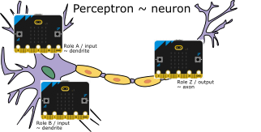

# microbitPerceptron

Framework and proof of concept for Machine Learning practices (perceptrons, MLP and on) using a swarm of Microbit, for high-school formal Education.

Microbits communicate via Bluetooth, which in turn are grouped (in app layer) in teams. Within each team, each microbit assumes a different role.  The whole class uses the same BT group, in order to accomodate a monitoring/teaching node.

## Proof of concept

In the case of this proof of concept, a Perceptron is formed by a team of three MB. Two acting as inputs/dendrites and one as the output/axon. Not a multi-layer perceptron, all three Microbits compose one perceptron. These are the roles of each one:

- Role A: sends a count of 3 things, multiplied by 1, valid values: {0,1,2,3}
- Role B: sends a count of (other) 3 things, multiplied by 2, valid values: {0,2,4,6}
- Role Z: Receives the data from A and B, adds them and applies a binary activation function that will be positive iif the sum exceeds 4.

## Credits

- heavily based on Prof Fujio Yamamoto's blog article on building a Microbit network emulating a [MLP](https://sparse-dense.blogspot.com/2018/06/microbittwo-layer-perceptronxor.html). Thanks a bunch, Mr Yamamoto!!
- (C) 2024 - [Leandro Batlle](https://www.linkedin.com/in/lean-b/) - Área de Innovación Educativa Científico-Tecnológica - [CNBA](https://www.cnba.uba.ar)

